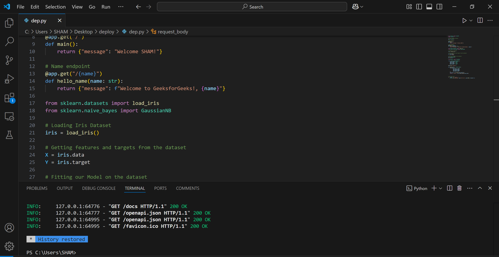
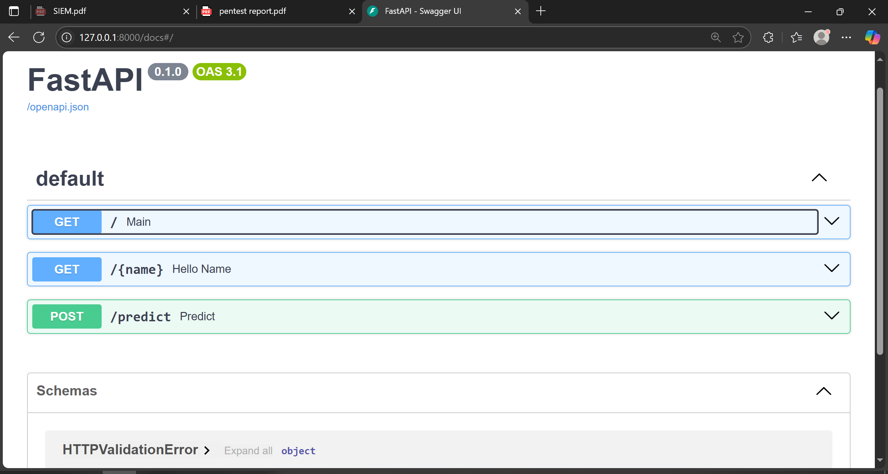
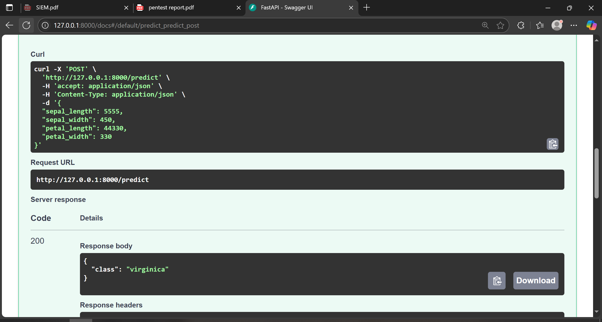

# 🚀 Python Deployment Automation

This repository contains a simple, lightweight script for **Python-based deployment automation**, along with screenshots demonstrating deployment performance and interface. Ideal for DevOps beginners, cybersecurity tool deployment, or automated testing environments.

> 🛡️ Developed by [Muhammad Ehtisham](https://www.linkedin.com/in/ehtishamcyber/) | 🌐 [www.ehtisham.space](https://www.ehtisham.space)

---

## 📁 Repository Contents

| File           | Description                                                              |
|----------------|--------------------------------------------------------------------------|
| `deployment.py`| Main Python script to automate deployment steps                          |
| `code.PNG`     | Screenshot showing core code implementation                              |
| `fast.PNG`     | Visual showing speed/performance or benchmark result                     |
| `testing.PNG`  | Screenshot from testing or validation phase of the deployment            |
| `README.md`    | Project documentation                                                    |

---

## ⚙️ About the Script

The `deployment.py` script is designed to simplify and speed up the process of deploying applications or services. It could be modified for:

- 💻 **Automating server setup**
- 🧪 **Launching test environments**
- 📦 **Packaging and pushing updates**

---

## 📸 Screenshots

### 🔧 Code Snapshot

### ⚡ Speed Test

### ✅ Deployment Test

---

## 💡 Use Cases

- Cybersecurity lab automation
- Test environment deployment for SOC simulations
- Proof-of-concept tool delivery in red/blue team operations
- Educational DevOps demos for university or portfolio

---

## 🧠 Future Improvements

- Add CLI arguments support for flexible deployment
- Integrate logging and rollback mechanism
- Add YAML/JSON-based config support for dynamic services

---

## 🧑‍💻 Author

**Muhammad Ehtisham**  
Cybersecurity Student | SOC Analyst | Python Automation Enthusiast  
📧 Email: CONNECTSHAM95@GMAIL.COM  
🔗 [LinkedIn](https://www.linkedin.com/in/ehtishamcyber/)  
🌐 [Website](https://www.ehtisham.space)

> “Simple deployments make secure operations faster.”

---

## 📜 License

Licensed under the [MIT License](https://opensource.org/licenses/MIT). You are free to use and modify for personal or academic purposes.

---

Let me know if you'd like this published as a GitHub Page or need additional markdown like deployment badges, CI/CD links, etc.
